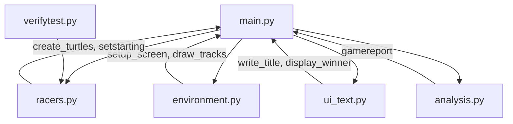
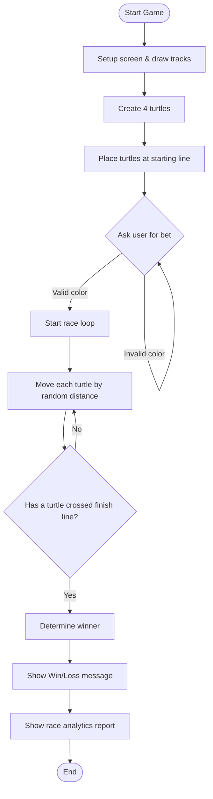
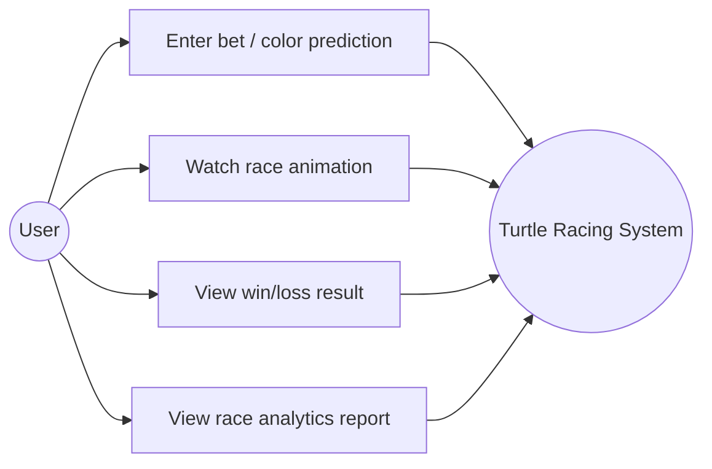
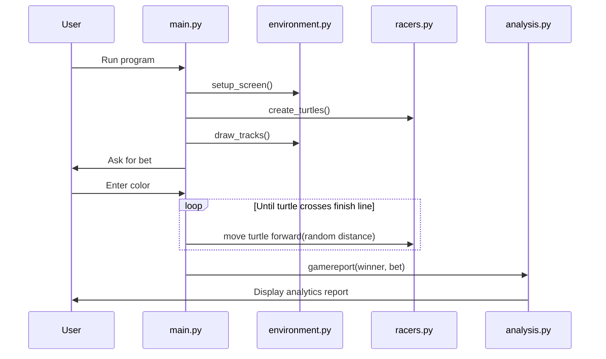

# Design Documentation

This file contains the system architecture, workflow, use case diagram, and non-functional requirements for the Turtle Racing Game project.

## Non-Functional Requirements

- **Usability** - the game gives clear on-screen prompts (e.g. "Which Turtle will win the race?") and re-asks the question if an invalid color is entered, so the user always knows what to do next.
- **Reliability** - the input validation loop in `main.py` makes sure the game never crashes or breaks due to bad user input; it just keeps asking until a valid color is given.
- **Maintainability** - the code is split into 6 separate files by responsibility (setup, racers, UI text, analysis, testing), so a bug or change in one part (e.g. track drawing) doesn't require touching unrelated files.
- **Performance** - the race loop uses small random increments per frame so the animation runs smoothly without noticeable lag on a normal machine.
- **Resource efficiency** - the game only uses built-in Python libraries (`turtle`, `random`), so there's no extra memory/dependency overhead from external packages.

## System Architecture Diagram

**Explanation:** `main.py` is the entry point that ties every module together. `environment.py` handles the screen and track visuals, `racers.py` handles turtle creation and starting positions, `ui_text.py` handles the title and win/lose message, and `analysis.py` generates the post-race report. `verifytest.py` is a standalone test file that imports `racers.py` to verify turtle creation independently of the game loop.

## Process Flow / Workflow Diagram

## Use Case Diagram

**Explanation:** The only actor in this system is the User. They interact with the system by placing a bet, watching the race, and then viewing the outcome and analytics. There's no admin/second actor since this is a single-player local game.

## Sequence Diagram (Race Flow)

## Notes

These diagrams are written in Mermaid syntax, which GitHub renders automatically when viewing the `.md` file in your repository - no extra image files needed. If your report PDF needs static images instead of code blocks, you can paste this Mermaid code into the [Mermaid Live Editor](https://mermaid.live) and export as PNG/SVG.
